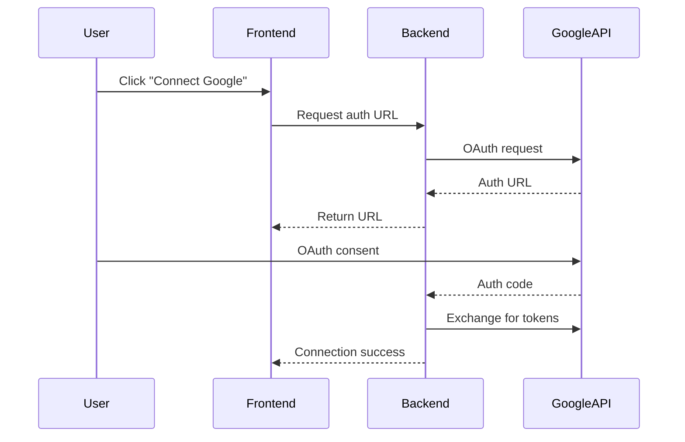
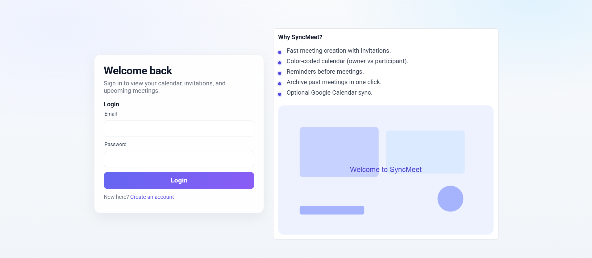
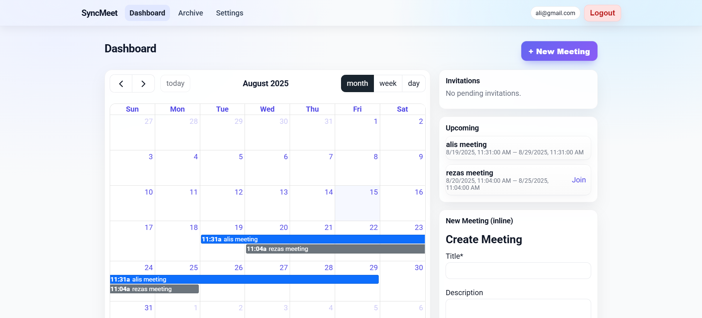
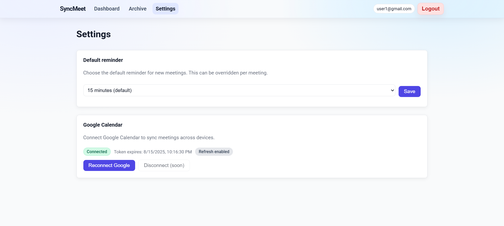

# 📅 SyncMeet

**Smart Meeting Scheduler with Google Calendar Integration**  
A full-stack meeting scheduling app with invitations, reminders, and Google Calendar sync.

---

## ✨ Features

- 🔐 **Authentication & Authorization** — Secure JWT-based login/register with persistent sessions.
- 📅 **Meeting Management** — Create, edit, and delete meetings with a modern interactive calendar.
- 📩 **Invitations** — Send, accept, or decline meeting invitations.
- ⏰ **Reminders** — Default/custom reminder times with browser notifications.
- ☁ **Google Calendar Integration** — OAuth 2.0 authentication with automatic sync.
- 📦 **Archive** — Store and manage past meetings.
- 🎨 **Responsive UI** — Optimized for desktop and mobile devices.

---

## 🛠 Tech Stack

| Layer       | Technology |
|-------------|------------|
| **Frontend**| React, React Router, Context API, Custom CSS |
| **Backend** | Node.js, Express.js |
| **Database**| MongoDB, Mongoose |
| **Integrations** | Google Calendar API |
| **Auth**    | JWT Authentication |
| **Security**| Helmet, CORS, Rate Limiting |

---

## 📂 Project Structure

```
project-root/
│
├── client/                 # React frontend
│   ├── src/
│   │   ├── components/     # UI components
│   │   ├── context/        # Auth and Toast providers
│   │   ├── pages/          # Page views (Dashboard, Archive, Settings, etc.)
│   │   ├── services/       # API service functions
│   │   ├── utils/          # Helper functions
│
├── server/                 # Node.js backend
│   ├── controllers/        # Request handlers
│   ├── middleware/         # Auth & error handling
│   ├── models/             # Mongoose schemas
│   ├── routes/             # API endpoints
│   ├── services/           # External API integrations (Google Calendar)
│
└── .env                    # Environment variables
```

---

## ⚙️ Installation

```bash
# 1. Clone the repository
git clone https://github.com/your-username/syncmeet.git
cd syncmeet

# 2. Install backend dependencies
npm install

# 3. Install frontend dependencies
cd client
npm install
```

---

## 🔑 Environment Variables

Create a `.env` file in the `server/` directory and configure:

```env
PORT=5000
MONGO_URI=your_mongodb_connection_string
JWT_SECRET=your_jwt_secret_key

# Google Calendar API
GOOGLE_CLIENT_ID=your_google_client_id
GOOGLE_CLIENT_SECRET=your_google_client_secret
GOOGLE_REDIRECT_URI=http://localhost:5000/api/google-calendar/callback
```

---

## ▶ Running the App (Local Development)

```bash
# Start backend
npm run dev

# Start frontend (in another terminal)
cd client
npm run dev
```

Frontend: **http://localhost:5173**  
Backend API: **http://localhost:5000**

---

## 🐳 Docker Deployment

This project includes Docker configurations for the **server**, **client**, and **MongoDB**.  
You can deploy the entire stack using Docker Compose without manually installing Node.js or MongoDB locally.

**Steps:**

```bash
# 1. Ensure server/.env exists with production values
#    Example:
#    PORT=5000
#    MONGO_URI=mongodb://mongo:27017/syncmeet
#    JWT_SECRET=your_jwt_secret_key

# 2. Build images
docker compose build

# 3. Start containers
docker compose up -d

# 4. Access:
#    Client: http://localhost:3000
#    Server: http://localhost:5000
```

**Notes:**
- `nginx.conf` handles serving the React app and proxying `/api` calls to the Express server.
- MongoDB data is persisted via a named Docker volume (`mongo_data`).
- If using Google OAuth, place your `credentials.json` in `server/` before starting containers.
- Remove the `version` line in `docker-compose.yml` if you want to avoid Compose warnings.

---

## 📡 API Endpoints

| Method | Endpoint | Description |
|--------|----------|-------------|
| POST   | `/api/users/register` | Register new user |
| POST   | `/api/users/login` | Login user |
| GET    | `/api/meetings` | Get meetings |
| POST   | `/api/meetings` | Create meeting |
| PUT    | `/api/meetings/:id` | Update meeting |
| DELETE | `/api/meetings/:id` | Delete meeting |
| GET    | `/api/invitations` | Get pending invitations |
| POST   | `/api/invitations/:id/respond` | Respond to invitation |
| GET    | `/api/google-calendar/status` | Check Google Calendar connection |
| GET    | `/api/google-calendar/auth-url` | Get OAuth URL for Google Calendar |

---

## 🔗 Google Calendar Flow



---

## 🔒 Security

- **JWT authentication**
- **Helmet** for securing HTTP headers
- **Rate limiting** to prevent abuse
- **CORS** configuration
- **Mongoose validation** against injection

---

## 📷 Screenshots

| Login Page | Dashboard | Settings |
|------------|-----------|----------|
|  |  |  |

---

## 🤝 Contributing

```bash
# 1. Fork repository
# 2. Create feature branch
git checkout -b feature-name

# 3. Commit changes
git commit -m "Add new feature"

# 4. Push and create PR
git push origin feature-name
```

---

## 📜 License

This project is licensed under the **MIT License** — feel free to use, modify, and distribute.
